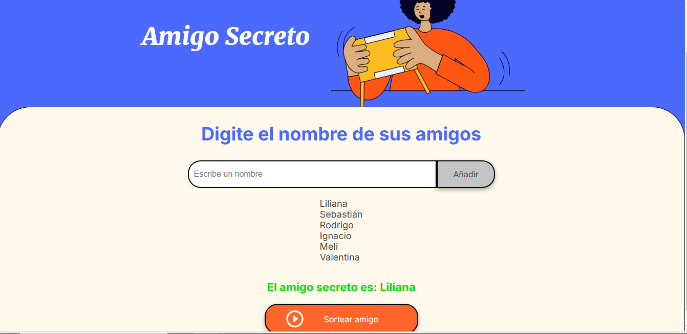

# 🎉 Juego de Amigo Secreto 🎉

¡Bienvenido/a al juego de Amigo Secreto! Este proyecto es una aplicación interactiva desarrollada en **HTML**, **CSS**, y **JavaScript** para organizar y sortear un amigo secreto de forma divertida y sencilla.

---

## 🚀 Funcionalidades

1. **Agregar Amigos:**
   - Ingresa los nombres de los participantes en el campo de texto y añádelos a la lista.

2. **Visualización en Tiempo Real:**
   - Los nombres ingresados se muestran automáticamente en una lista interactiva.

3. **Sorteo Aleatorio:**
   - Presiona el botón "Sortear amigo" para seleccionar aleatoriamente un amigo secreto de la lista.

4. **Validaciones:**
   - El campo de entrada no acepta valores vacíos.
   - No puedes sortear si la lista está vacía.

---

## 🖥️ Tecnologías Utilizadas

- **HTML5:** Estructura semántica de la aplicación.
- **CSS3:** Estilo moderno con uso de variables CSS y diseño responsivo.
- **JavaScript:** Lógica del juego y manejo dinámico del DOM.

---

## 📂 Estructura del Proyecto

```
|-- index.html   # Archivo principal HTML
|-- style.css    # Estilos personalizados
|-- app.js       # Lógica del juego
|-- assets/      # Imágenes e íconos utilizados
```

---

## 🛠️ Instalación y Ejecución

1. **Clonar el Repositorio:**
   ```bash
   git clone https://github.com/tu-usuario/amigo-secreto.git
   ```

2. **Abrir el Proyecto:**
   Navega a la carpeta del proyecto y abre el archivo `index.html` en tu navegador.

---

## 📸 Vista Previa



---

## 🎨 Personalización

- **Colores y Estilo:** Modifica las variables CSS en el archivo `style.css` para personalizar la apariencia.
- **Número de Participantes:** Puedes ampliar las validaciones o funcionalidades según las necesidades de tu sorteo.

---

## 🤝 Contribuciones

¡Las contribuciones son bienvenidas! Si tienes una idea para mejorar este proyecto, no dudes en enviar un pull request o abrir un issue.

---

## 📄 Licencia

Este proyecto está bajo la [MIT License](LICENSE). Puedes usarlo y modificarlo libremente.

---

## 💡 Inspiración

Este proyecto es una forma creativa de practicar habilidades en desarrollo web y lógica de programación mientras se disfruta de una actividad clásica y divertida. ¡Espero que lo disfrutes tanto como yo desarrollándolo! 😄

